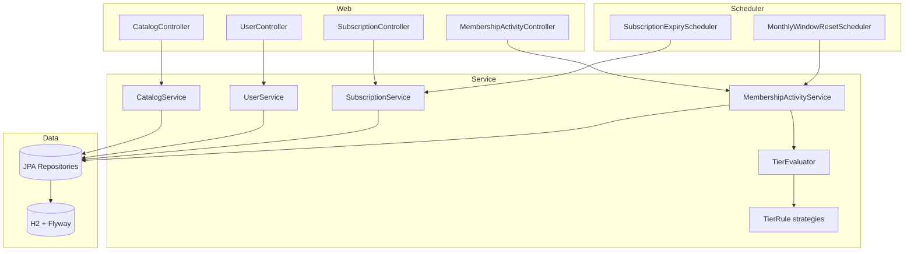

# FirstClub Membership Program

Backend for a subscription-based membership program with tiered, configurable benefits.
Members choose a **plan** (billing cycle) and hold a **tier** (loyalty level) that unlocks perks
and progresses automatically based on their purchasing activity.

Built with Java 21, Spring Boot 3, Spring Data JPA, Flyway, H2, and springdoc-openapi (Swagger UI).

---

## Quick start

No local setup required — the app runs against an in-memory H2 database that Flyway migrates and
seeds on startup.

```bash
./mvnw spring-boot:run
```

The API is then available at `http://localhost:8080`. Run the tests with:

```bash
./mvnw test
```

Two demo users (`alice@example.com`, `bob@example.com`) and the full plan/tier catalogue are seeded
automatically. The H2 console is at `http://localhost:8080/h2-console`
(JDBC URL `jdbc:h2:mem:membership`, user `sa`, no password).

Interactive API docs (Swagger UI, via springdoc-openapi) are at
`http://localhost:8080/swagger-ui.html`, with the raw OpenAPI spec at `/v3/api-docs`.

---

## Domain model

The two axes a member picks are deliberately kept separate, exactly as the brief states
("subscribe to a plan **(plan + tier)**"):

| Concept | Meaning | Examples |
|---|---|---|
| **Plan** | Billing cycle + price. What the member pays for. | Monthly ₹299, Quarterly ₹799, Yearly ₹2499 |
| **Tier** | Loyalty level that unlocks benefits. Earned by activity or chosen at subscribe. | Silver, Gold, Platinum |

Price lives on the plan; tiers do not change the price (a tier is a loyalty level, not a paid
upgrade). Benefits and the criteria to reach each tier are stored in the database, so they are
**configurable without code changes**.

### ER diagram

```mermaid
erDiagram
    USER ||--o| SUBSCRIPTION : has
    USER ||--|| MEMBERSHIP_ACTIVITY : tracks
    PLAN ||--o{ SUBSCRIPTION : "billed as"
    TIER ||--o{ SUBSCRIPTION : "held at"
    TIER ||--o{ BENEFIT : unlocks
    TIER ||--|| TIER_CRITERIA : "qualified by"

    USER { long id PK; string name; string email UK; string cohort; timestamp created_at }
    PLAN { long id PK; string billing_cycle UK; decimal price }
    TIER { long id PK; string name UK; int level }
    BENEFIT { long id PK; long tier_id FK; string type; string benefit_value }
    TIER_CRITERIA { long id PK; long tier_id FK; int min_order_count; decimal min_monthly_spend; string required_cohort }
    SUBSCRIPTION { long id PK; long user_id FK; long plan_id FK; long tier_id FK; string status; date start_date; date end_date; long version }
    MEMBERSHIP_ACTIVITY { long id PK; long user_id FK; int order_count; decimal monthly_spend; decimal total_spend; date window_start }
```

---

## Architecture

A conventional layered Spring Boot application. Controllers stay thin, services hold business
orchestration, and the entities themselves own their lifecycle rules so they cannot be bypassed.



### Package structure

```
com.firstclub.membership
├── config/        Clock bean, OpenAPI metadata
├── controller/    REST endpoints (thin)
├── dto/           Request/response records + API envelope
├── entity/        JPA entities + domain enums (rich behaviour)
├── exception/     Domain exceptions + @RestControllerAdvice
├── mapper/        Entity → DTO mapping (manual, static)
├── repository/    Spring Data JPA repositories
├── scheduler/     Expiry + window-reset jobs
└── service/
    └── tier/      Tier evaluation Strategy (TierEvaluator + TierRule rules)
```

`service/tier` is the only sub-package: it groups the five-class tier-evaluation strategy so it
reads as one cohesive unit instead of being scattered across `service/`.

---

## API

All responses share one envelope: `{ "success": boolean, "data": ..., "error": ... }`.

| Method | Path | Purpose |
|---|---|---|
| `GET` | `/api/plans` | List available plans |
| `GET` | `/api/tiers` | List tiers with their benefits |
| `POST` | `/api/users` | Create a user |
| `GET` | `/api/users/{id}` | Get a user |
| `POST` | `/api/subscriptions` | Subscribe to a plan + tier |
| `GET` | `/api/users/{id}/subscription` | Current membership and expiry |
| `PATCH` | `/api/subscriptions/{id}/tier` | Upgrade or downgrade tier |
| `DELETE` | `/api/subscriptions/{id}` | Cancel a subscription |
| `POST` | `/api/users/{id}/orders` | Record an order → auto-evaluate tier |

### Example walkthrough

```bash
# Subscribe Alice (user 1) to a monthly plan at Silver
curl -X POST localhost:8080/api/subscriptions \
  -H 'Content-Type: application/json' \
  -d '{"userId":1,"billingCycle":"MONTHLY","tier":"SILVER"}'

# Record orders that push her over the Gold threshold (5 orders / ₹5000 monthly)
for i in $(seq 1 5); do
  curl -X POST localhost:8080/api/users/1/orders \
    -H 'Content-Type: application/json' -d '{"amount":1200}'
done

# Her active subscription has been auto-upgraded to GOLD
curl localhost:8080/api/users/1/subscription
```

Sample success response:

```json
{
  "success": true,
  "data": {
    "id": 1, "userId": 1, "billingCycle": "MONTHLY", "price": 299.00,
    "tier": "GOLD", "status": "ACTIVE",
    "startDate": "2026-06-26", "endDate": "2026-07-26", "daysRemaining": 30
  }
}
```

Sample validation error (`400`):

```json
{ "success": false, "error": { "message": "Validation failed",
  "fieldErrors": [{ "field": "amount", "message": "must be greater than 0" }] } }
```

Status codes: `201` create, `200` reads/updates, `400` validation, `404` not found,
`409` business-rule violation or concurrent update.

---

## Key design decisions

- **Strategy for tier evaluation.** Each qualification criterion (order count, monthly spend,
  cohort) is a `TierRule` bean. `TierEvaluator` injects `List<TierRule>` and awards the highest
  tier whose rules *all* pass. Adding a new criterion means adding one bean — no existing code
  changes. This is the one place the brief's "extensibility" requirement genuinely calls for a
  pattern, so it is the one place a pattern is used.
- **Rich entities, not anemic ones.** Lifecycle rules live on `Subscription`
  (`start`/`changeTier`/`cancel`/`expire`, each guarded so an expired subscription can't be
  cancelled) and `MembershipActivity` (`recordOrder`/`resetMonthlyWindow`). Services orchestrate;
  they don't re-implement domain maths.
- **Configurable benefits and criteria.** Both are rows in the database (`benefits`,
  `tier_criteria`) seeded by Flyway, so perks and thresholds change without a redeploy.
- **Upgrade-on-order, downgrade-on-reset.** Recording an order only ever raises a tier (metrics
  grow monotonically within a window), so a member is never demoted mid-window. Downgrades are
  applied when the monthly window resets and spend rolls back to zero.
- **Manual mapping over a mapping framework.** The DTO mapping is small and explicit; MapStruct
  would add a dependency and generated code for no real benefit.
- **`Clock` bean.** All "today" reads go through an injected `Clock`, so time-dependent logic
  (expiry, window resets) is tested with a fixed clock instead of the wall clock.

---

## Concurrency

`Subscription` carries a JPA `@Version` column (optimistic locking). Upgrade, downgrade, cancel,
and the scheduled expiry job all mutate subscriptions, and a member could trigger several of these
at once (e.g. a double-tapped "upgrade" while the nightly expiry job runs). With optimistic
locking, the second write to a stale version fails fast with
`ObjectOptimisticLockingFailureException`, which the exception handler maps to `409 Conflict`
("updated concurrently, please retry") instead of silently overwriting the first change.

Optimistic locking is chosen over pessimistic locking or `synchronized` because contention on a
single subscription is rare; paying for a lock on every read would be the wrong trade-off, and
`synchronized` would not work across multiple application instances anyway.

---

## Assumptions

- There is no separate order service, so `POST /api/users/{id}/orders` stands in for order
  completion events and feeds the activity metrics that drive tier evaluation.
- A user holds at most one **active** subscription at a time. H2 has no partial unique index, so
  this is enforced in the service layer; the equivalent PostgreSQL partial index is documented in
  `V1__schema.sql`.
- The monthly spend window is a rolling one-month period per member; a real system would likely
  align it to calendar months or the billing anchor date.
- Authentication/authorization is out of scope for this assignment.

## Future improvements

- Replace the synchronous "record order" call with an event/queue so membership reacts to orders
  asynchronously.
- Add a benefits-resolution endpoint that returns the concrete perks applied at checkout.
- Move tier thresholds behind an admin API so they can be tuned at runtime, not just via seed data.
- Add integration tests (`@SpringBootTest`) covering the full HTTP + persistence path alongside the
  current unit tests.
- Switch to PostgreSQL with the partial unique index for the one-active-subscription invariant.
```
